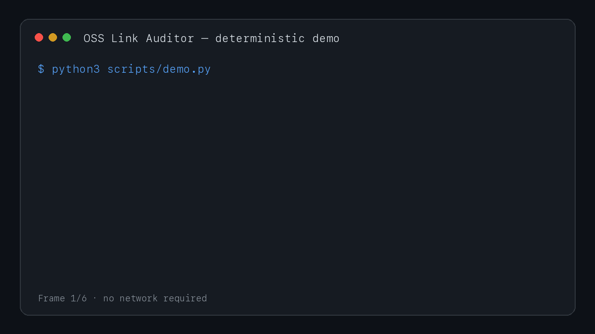

# OSS Link Auditor

[](https://github.com/Aryalmilan-max/oss-link-auditor/actions/workflows/test.yml)
[](https://github.com/Aryalmilan-max/oss-link-auditor/actions/workflows/codeql.yml)
[](https://github.com/marketplace/actions/oss-link-auditor)
[](https://github.com/Aryalmilan-max/oss-link-auditor/releases/latest)
[](https://www.python.org/)
[](LICENSE)


**Turn broken links, silent redirects, and unsafe network targets into one
source-aware trust report.**

OSS Link Auditor is a transparent Python CLI and GitHub Action for maintainers
of documentation, awesome lists, knowledge bases, and resource catalogs. It was
extracted from real maintenance work where a redirect can be more dangerous than
a simple 404: an expired domain may now lead to unrelated or hijacked content.

It never disables TLS verification and never deletes content automatically.
Every finding includes the Markdown file and line where it appeared, so the
report leads directly to a reviewable fix.

## Add it to a repository

Create `.github/workflows/link-audit.yml`:

```yaml
name: Audit Markdown links

on:
  pull_request:
  workflow_dispatch:

permissions:
  contents: read

jobs:
  audit:
    runs-on: ubuntu-latest
    steps:
      - uses: actions/checkout@v5
      - uses: Aryalmilan-max/oss-link-auditor@v0.1.1
        with:
          paths: |
            README.md
            docs
          fail-on-broken: "true"
```

See a [successful run in a separate consumer repository](https://github.com/Aryalmilan-max/oss-link-auditor-consumer-demo/actions/runs/36429117129)
or copy the versioned setup from the
[GitHub Marketplace listing](https://github.com/marketplace/actions/oss-link-auditor).

## See it in 60 seconds



Clone the project and run the deterministic demo—no public network required:

```bash
git clone https://github.com/Aryalmilan-max/oss-link-auditor.git
cd oss-link-auditor
python3 scripts/demo.py
```

The report separates `HEALTHY`, `REDIRECT`, `REDIRECT-CROSS-HOST`, `BROKEN`,
and `BLOCKED` findings and shows exact `file:line` source locations.
`make demo` is an equivalent convenience command.

Want to evaluate the Action in another repository? Copy the
[consumer workflow](examples/link-audit.yml), run it manually, and inspect the
trust report in the GitHub Actions job summary.

## Why another link checker?

Many link checkers optimize for a single green-or-red result. Maintainers often
need more context:

- **Broken links** need review, but a temporary network failure is not proof.
- **Redirects** may be harmless migrations—or evidence that ownership changed.
- **Repeated URLs** should be checked once, even across many Markdown files.
- **CI failures** need deterministic output that humans can inspect.
- **Untrusted links** must not silently probe loopback or private services.

OSS Link Auditor reports these cases separately and keeps the implementation
small enough to audit.

## Quick start

Requires Python 3.10 or newer and has no runtime dependencies.

```bash
git clone https://github.com/Aryalmilan-max/oss-link-auditor.git
cd oss-link-auditor
make setup
. .venv/bin/activate
oss-link-auditor README.md docs/
```

Example text report:

```text
Scanned 8 file(s), 42 unique link(s): 40 healthy, 1 redirect(s), 1 broken, 0 blocked.
[BROKEN] docs/resources.md:27 https://example.com/old-guide HTTPError: HTTP Error 404
[REDIRECT-CROSS-HOST] README.md:14 https://example.com/start -> https://docs.example.org/start
```

Machine-readable output:

```bash
oss-link-auditor . --json
oss-link-auditor . --json > link-report.json
oss-link-auditor . --markdown > link-report.md
```

Fail CI only when a link is broken or unreachable:

```bash
oss-link-auditor . --fail-on-broken
```

## Action options and security

Add this workflow to `.github/workflows/link-audit.yml`:

```yaml
name: Audit Markdown links

on:
  pull_request:
  workflow_dispatch:

permissions:
  contents: read

jobs:
  audit:
    runs-on: ubuntu-latest
    steps:
      - uses: actions/checkout@v5
      - uses: Aryalmilan-max/oss-link-auditor@v0.1.1
        with:
          paths: |
            README.md
            docs
          fail-on-broken: "true"
```

The Action publishes the trust report in the workflow summary. For production
workflows, pin third-party actions—including this one—to a full commit SHA after
reviewing the source. The Marketplace page provides versioned installation
syntax; the [consumer proof](https://github.com/Aryalmilan-max/oss-link-auditor-consumer-demo)
shows the same Action running outside this repository.

## Safe network defaults

Private, loopback, link-local, multicast, and reserved targets are blocked by
default, including redirect destinations. Use `--allow-private` only when
auditing trusted internal documentation. DNS can change between validation and
connection, so untrusted pull requests still belong on isolated hosted runners,
not self-hosted runners with access to internal services. See
[SECURITY.md](SECURITY.md).

## Troubleshooting

If every public HTTPS link reports `TLSCertificateError`, install or update the
CA certificates for the Python environment. On the python.org macOS installer,
run the bundled `Install Certificates.command`; on managed systems, follow the
OS or Python distributor's CA setup. The tool will not bypass certificate
verification to hide this environment problem.

## Supported Markdown links

- inline links: `[Guide](https://example.com/guide)`
- reference definitions: `[guide]: https://example.com/guide`
- autolinks: `<https://example.com/guide>`
- recursive discovery of `.md` and `.markdown` files

Image URLs are intentionally excluded from the current release.

## Common use cases

- stop broken documentation links from merging
- review domain changes in an awesome list or resource catalog
- export JSON for a maintenance dashboard or follow-up script
- surface suspicious cross-host redirects without rewriting content
- block accidental access to internal targets during normal audits

## CLI reference

```text
oss-link-auditor PATH [PATH ...] [--workers N] [--timeout SECONDS]
                 [--json | --markdown] [--fail-on-broken] [--allow-private]
```

There is no configuration file in v0.1.1. Explicit command arguments keep CI
behavior visible. Exit codes are `0` for a completed audit, `1` when
`--fail-on-broken` finds failures, and `2` for invalid input or setup errors.

## Choosing the right workflow

| Need | Manual URL checks | Status-only checker | OSS Link Auditor |
| --- | --- | --- | --- |
| Occasional single URL | Good fit | Good fit | More than needed |
| Recursive Markdown discovery | Manual | Varies | Built in |
| Exact source file and line | Manual | Varies | Built in |
| Cross-host redirect signal | Manual inspection | Often combined with success | Separate category |
| Private-target blocking | Depends on operator | Varies | Default policy |
| Automatic content rewrite | Manual | Tool-dependent | Intentionally never |

This table compares workflows, not named competitors; evaluate alternatives
against your repository's actual parser, network, and reporting requirements.

## Design principles

1. Keep normal TLS certificate verification enabled.
2. Treat automated failures as review signals, not deletion instructions.
3. Make redirects visible because final ownership may differ.
4. Prefer deterministic, inspectable output over hidden heuristics.
5. Keep the runtime dependency-free.

The architecture and trust boundaries are documented in
[docs/ARCHITECTURE.md](docs/ARCHITECTURE.md).

## Contributing

Good first contributions include parser edge cases, clearer reports, and tests
for real maintainer workflows. Read [CONTRIBUTING.md](CONTRIBUTING.md) and see
the [roadmap](ROADMAP.md) before opening a pull request.

## Project status

This is an early, working release. The CLI, tests, and GitHub Action are usable;
the interface may evolve based on maintainer feedback. See
[CHANGELOG.md](CHANGELOG.md).

## License

MIT. See [LICENSE](LICENSE).
